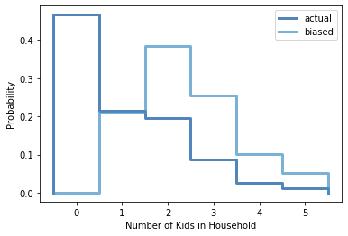

[Think Stats Chapter 3 Exercise 1](http://greenteapress.com/thinkstats2/html/thinkstats2004.html#toc31) (actual vs. biased)

#This problem demonstrates the importance of taking into account any bias introduced from the class size paradox. For this example, we will look at what the pmfs of household size for children under 18 look like if we sample each household and if we sample each child in the household.
##First let's load the dataset.
```
resp = nsfg.ReadFemResp()
```
##Then let's create the pmf that represents the actual number of children per household.
```
actual_pmf = thinkstats2.Pmf(resp.numkdhh)
```
##To introduce the oversampling bias, we need the following function.
```
# A function to introduce bias discussed in class size paradox
def ClassSizeBias(pmf, label):
    '''Create's a Pmf with oversampling proportional to value
    Args:
    pmf: thinkstats2 Pmf object
    
    Returns:
        Pmf object
    '''
    biased_pmf = pmf.Copy(label=label)
    
    for x, p in pmf.Items():
        biased_pmf.Mult(x, x)
        
    biased_pmf.Normalize()
    return biased_pmf

#Makes biased pmf:
biased_pmf = ClassSizeBias(actual_pmf, label='biased')
```
##Finally, let's compare the stepwise graphs of each pmf.
```# Plots for Biased and Actual family size
thinkplot.PrePlot(2)
thinkplot.pmf(actual_pmf, label='actual')
thinkplot.pmf(biased_pmf, label='biased')
thinkplot.config(xlabel='Number of Kids in Household', ylabel='Probability')
```

##Computing the means of each pmf,
```print("Actual Mean:", actual_pmf.Mean())
   print("Biased Mean:", biased_pmf.Mean())
```
##We find that the actual mean is around 1.02 children, while the biased mean is around 2.4 children!
###Households with n children got overrepresented by n times,
Meaning households with zero children got their pmf values bumped
down to zero and households with larger amounts of children got
increased in the values of their pmf.

