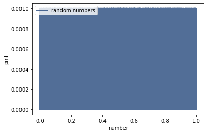
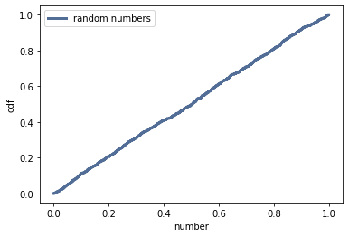

[Think Stats Chapter 4 Exercise 2](http://greenteapress.com/thinkstats2/html/thinkstats2005.html#toc41) (a random distribution)

## This question asks us to generate a random sample using numpy's random.random() method and test whether or not it's trully random by analyzing the PMF and CDF of the random Sample.

### First lets start by importing numpy and the thinkstats files that will allow us to create cdf and pmf (I will come back later and write my own functions for these)
```
    import numpy as np
    import thinkstats2
    import thinkplot
```

### Now lets generate our random sample and create our cdf and pmf.
```
nums = np.random.random(1000)
pmf = thinkstats2.Pmf(nums, label='random numbers')
cdf = thinkstats2.Cdf(nums, label='random numbers')
```

### Finally, lets take a look at the graph of the pmf and cdf.
```
thinkplot.pmf(pmf)
thinkplot.config(xlabel='number', ylabel='pmf')
```



```
thinkplot.cdf(cdf)
thinkplot.config(xlaebel='number', ylabel='cdf')
```


### Since the PMF is shaped like a rectangle, each of the points is equallyt probable. Furthermore, the CDF shows a straight line, suggesting again that our distribution is uniform. After running numpy's random number function several times and getting the same result, I can safely conclude that numpy's random number method is sufficiently random. 